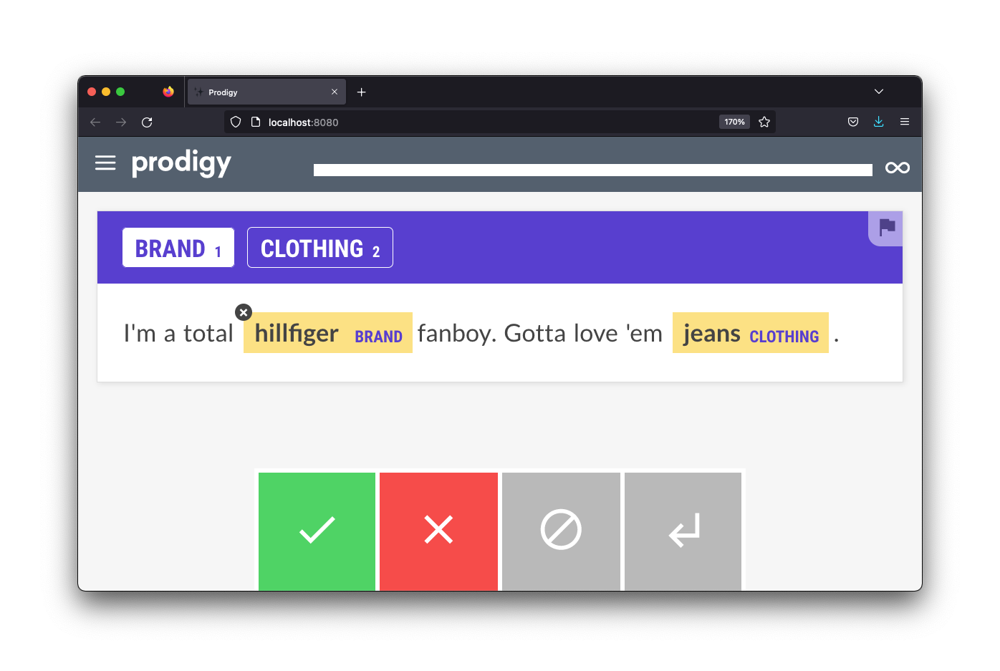
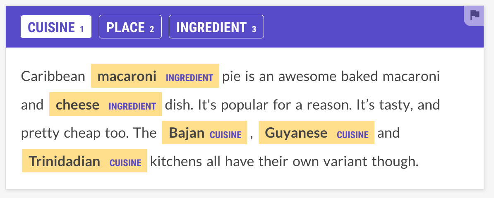
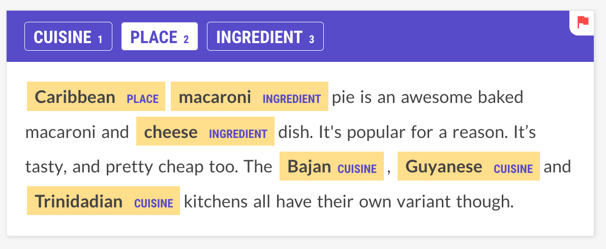

# openai-prodigy-recipes

An internal repo to share code for OpenAI recipes.

## Setup and Install 

Before running any demos, you need to make sure that the `.env` file contains the right keys. 

```
OPENAI_ORG = "org-..."
OPENAI_KEY = "sk-..."
```

You'll also want to make sure the non-Prodigy dependencies are installed. 

```
python -m pip install -r requirements.txt
```

## Running the NER demos. 

We're hosting recipes that use zero/few-shot learning via OpenAI. 


The recipe can take examples from a local `.jsonl` file and turn them into NER annotation prompts. These can be sent to GPT-3, hosted by OpenAI, which respond with an answer. The recipes handle the translation between Prodigy and OpenAI such that you can confirm the annotations easily from Prodigy. It's very much like using the standard [`ner.correct`](https://prodi.gy/docs/recipes#ner-correct) recipe in Prodi.gy, but we're using GPT-3 as a backend model to make predictions. 

## First Steps

For the first demo we'll use an `examples.jsonl` file that contains the following examples. 

```
{"text": "I'm a total hillfiger fanboy. Gotta love 'em jeans."}
{"text": "Levis all the way. Their jeans are solid, but their jackets are better than old navy."}
{"text": "club monaco's Super Slim Twill Pant is pretty good. i like the taper but the thighs and seat are a bit too skinny for my tastes."}
```

The goal of this dataset is to extra the fashion brands with the clothing items. So let's see what OpenAI can annotate for us! We can use the `ner.openai.correct` to send examples to their API and get a prediction back.

```
python -m prodigy ner.openai.correct fashion-openai examples.jsonl "brand,clothing" -F recipes/ner.py
```

Here's what the annotation interface will look like. 



You'll notice that the annotation interface comes with values pre-filled, which can speed up annotation.

### Curious about the prompt?

If you're curious to see what we send to OpenAI and what we get back, you can run the recipe with the `-v` verbose flag. This will print the prompt and the response in the terminal as traffic is received. 

```
╭────────────────────────────────── Prompt to OpenAI ─────────────────────────────╮
│ From the text below, extract the following entities in the following format:    │
│ brand: <comma delimited list of strings>                                        │
│ clothing: <comma delimited list of strings>                                     │
│                                                                                 │
│ Text:                                                                           │
│ """                                                                             │
│ I'm a total hillfiger fanboy. Gotta love 'em jeans.                             │
│ """                                                                             │
│                                                                                 │
╰─────────────────────────────────────────────────────────────────────────────────╯
╭──────────────────────────────── Response from OpenAI ───────────────────────────╮
│                                                                                 │
│ brand: Hillfiger                                                                │
│ clothing: Jeans                                                                 │
╰─────────────────────────────────────────────────────────────────────────────────╯
```

This repo also provides templates that you can customise in the `/templates` folder. We use `jinja2` to populate these templates with prompts, but you can choose to create your own template and use it via the `--prompt-path` option. 

## Fetching data upfront 

Right now we are fetching examples from OpenAI while annotating, but we've also included a recipe can get fetch a large batch of examples upfront. 

```
python -m prodigy ner.openai.fetch examples.jsonl fetched-examples.jsonl "cuisine,place,ingredient" -F recipes/ner.py
```

This will create a `fetch-examples.jsonl` file that can be loaded by our the [ner.manual](https://prodi.gy/docs/recipes#ner-manual) recipe.

## Better Suggestions 

At some point, you might notice OpenAI make a mistake. We noticed it making errors on this example:

```
{"text": "Caribbean macaroni pie is an awesome baked macaroni and cheese dish. It's popular for a reason. It’s tasty, and pretty cheap too. The Bajan, Guyanese and Trinidadian kitchens all have their own variant though."}
```

Using this call: 

```
python -m prodigy ner.openai.correct cooking-openai examples.jsonl "cuisine,place,ingredient" -F recipes/ner.py
```

It generated this:



It's a relatively minor mistake, but notice how "Caribbean" didn't get picked up. OpenAI isn't perfect. Mistakes can come in all sorts of shapes and sizes, but we are able to steer the output by adding some more examples to the prompt. 

### Adding Examples to the Prompt

So let's annotate this example so we may add it to the prompt. 



Note that I'm also flagging this example, which makes it easier for me to retreive it into a file. The command below does just that.

```
python -m prodigy db-out cooking-openai | grep \"flagged\":true > prompt-examples.jsonl
```

