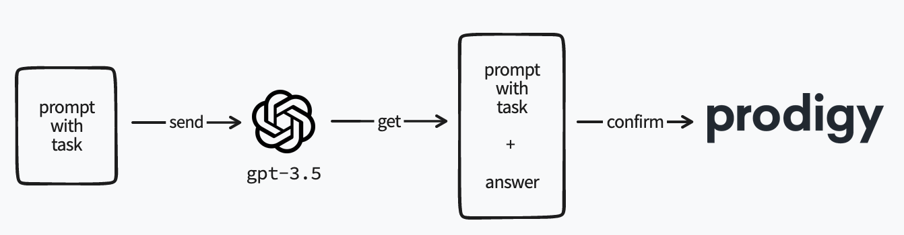

# openai-prodigy-recipes

An internal repo to share code for OpenAI recipes.



## Setup and Install 

Before running any demos, you need to make sure that the `.env` file contains the right keys. 

```
OPENAI_ORG = "org-..."
OPENAI_KEY = "sk-..."
```

You'll also want to make sure the non-Prodigy dependencies are installed. 

```
python -m pip install requirements.txt
```

## Running the NER demo. 

You can run the experiment via: 

```
python -m prodigy ner.openai.correct openai-ner-demo ner-examples.jsonl en -l person,place,company -F openai-ner.py
```

If you'd like to understand the prompts and reponses, feel free to use the `--verbose` flag. It'll give extra output that looks like below: 

```
╭─────────────────────────── Prompt to OpenAI ───────────────────────────╮
│ From the text below, extract the following entities in the following   │
│ format:                                                                │
│ Person: <comma-separated list of each person mentioned>                │
│ Place: <comma-separated list of each place mentioned>                  │
│ Company: <comma-separated list of each company mentioned>              │
│                                                                        │
│ Text:                                                                  │
│ """                                                                    │
│ Vincent D. Warmerdam lives in Haarlem with two cats. They are called   │
│ Sok and Noa.                                                           │
│ """                                                                    │
│                                                                        │
│ Answer:                                                                │
│                                                                        │
╰────────────────────────────────────────────────────────────────────────╯
╭───────────────────────── Response from OpenAI ─────────────────────────╮
│ Person: Vincent D. Warmerdam                                           │
│ Place: Haarlem                                                         │
│ Company:                                                               │
╰────────────────────────────────────────────────────────────────────────╯
```

## Running the Textcat Demo 

You can run the experiment via: 

```
python -m prodigy textcat.openai.correct openai-textcat-demo textcat-examples.jsonl en -l positive,negative,neutral -F openai-textcat.py
```

If you'd like to understand the prompts and reponses, feel free to use the `--verbose` flag. It'll give extra output that looks like below: 

```
╭──────────────────────────────── Prompt to OpenAI ─────────────────────────────────╮
│ From the text below, tell me which class describes it best. From the following    │
│ list:                                                                             │
│ - positive                                                                        │
│ - negative                                                                        │
│ - neutral                                                                         │
│                                                                                   │
│ Text:                                                                             │
│ """                                                                               │
│ Oh no!                                                                            │
│ """                                                                               │
│                                                                                   │
│ Answer:                                                                           │
│                                                                                   │
╰───────────────────────────────────────────────────────────────────────────────────╯
╭────────────────────────────── Response from OpenAI ───────────────────────────────╮
│                                                                                   │
│ negative                                                                          │
╰───────────────────────────────────────────────────────────────────────────────────╯
```

## Running the Paraphrase Demo 

This demo demonstrates how you can generate more training data by having OpenAI generate more relevant examples. This recipe works by 
declaring a task in natural language together with some examples of stuff you'd like to see more of. In this demo, we're generating fast food orders for a span annotation task.

You can run the experiment via: 

```
python -m prodigy spancat.openai.paraphrase openai-spancat-demo paraphrase-examples.jsonl en paraphrase-task.txt -l amount,size,toppings,type,product -F openai-paraphrase.py
```

If you'd like to understand the prompts and reponses, feel free to use the `--verbose` flag. It'll give extra output that looks like below: 

```
╭───────────────────────────────────────── Prompt to OpenAI ─────────────────────────────────────────╮
│ The task is to examples of people ordering food at a McDonalds                                     │
│ Examples should sometimes also include drink orders and side-dishes.                               │
│ It is preferable to come up with elaborate combinations of items.                                  │
│ I want more examples of sentences like below.                                                      │
│                                                                                                    │
│ Current examples:                                                                                  │
│                                                                                                    │
│ - A Big Mac with extra bacon, an order of French fries with spicy ketchup, and a xl mountain dew.  │
│ - A Quarter Pounder with cheese, a McChicken, and a large sweet tea.                               │
│ - A Filet-O-Fish, a cheeseburger, and an order of onion rings.                                     │
│ - A Big Mac with extra pickles, a 10-piece McNuggets, and a large strawberry milkshake.            │
╰────────────────────────────────────────────────────────────────────────────────────────────────────╯
╭─────────────────────────────────────── Response from OpenAI ───────────────────────────────────────╮
│                                                                                                    │
│ - A Double Cheeseburger, a McFlurry, and a small Coke.                                             │
│ - A double cheeseburger with extra bacon, a large order of fries, and a Diet Coke.                 │
│ - A Bacon McDouble, a McChicken, and a large orange juice.                                         │
│ - A Quarter Pounder Deluxe with extra onions, a McFlurry, and a medium Sprite.                     │
│ - A Big Mac with extra lettuce, a 6-piece McNuggets, and a large iced                              │
╰────────────────────────────────────────────────────────────────────────────────────────────────────╯
```